
<h1 align="center">社区疫情管理系统</h1>

## 简介
社区疫情管理系统：角色分为管理员、用户；功能包括个人中心、新闻信息、物资管理、隔离信息管理、疑似人员管理、健康打卡、论坛管理等，帮助社区有效管理和交流疫情相关信息。    --计算机毕业设计源码；毕设源码；java毕业设计源码

## 联系方式

<h3 align="center">获取完整代码与数据库文件 + 微信：deepguan QQ: 86050149 QQ群: 783742310</h3>

<h3 align="center">可帮忙远程部署 包运行成功！提供远程部署、修改代码、设计文档指导、代码讲解等服务！</h3>

## 功能介绍（完整见运行截图）
管理员： 个人中心与用户信息管理：可以查看、编辑和删除用户信息，及重置用户密码。新闻及论坛管理：管理新闻信息、论坛帖子及回复，确保信息发布准确和安全。物资管理：查看、分配和统计物资的使用情况，监督物资的分发流程及状态。健康管理：管理社区内疫情防控信息，包括健康打卡、疑似人员与隔离信息。系统设置：更新系统配置和权限管理，确保系统功能正常运作。

社区志愿者：健康信息管理：协助用户进行每日健康打卡，记录体温和健康状态。物资分发：帮助统计和分配物资，为居民提供支持和帮助。隔离与防疫宣导：协助管理和录入隔离人员信息，并进行疫情防控知识宣导。信息更新：协助发布和更新新闻信息，促进居民间的信息交流与共享。

普通用户：个人中心：查看和编辑个人信息，安全地管理账户及修改密码。健康打卡：每日登录上传健康码信息，提交体温及健康状况。物资申请：申请和查看物资分配信息，管理个人物资领取及订单状态。社区互动：参与论坛，查看并评论新闻信息，获取最新社区动态与政策。

疑似或隔离人员：疑似信息录入：填写并提交疑似情况，上传相关证明照片进行信息反馈。隔离管理：接收隔离安排通知，更新个人隔离状态并与管理人员沟通。健康状态更新：定期更新体温和健康状况信息，以便跟踪和管理。物资与支持获取：通过系统申请必要的生活或防疫物资，并了解社区的援助方案。

## 运行截图
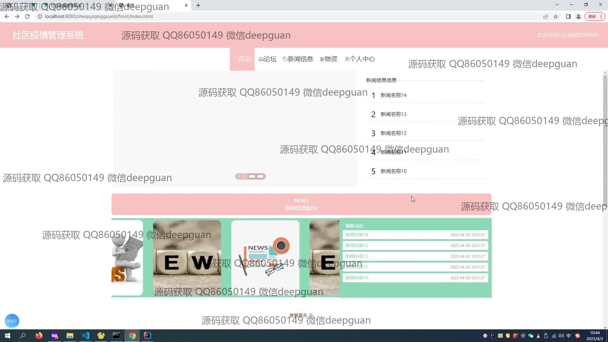
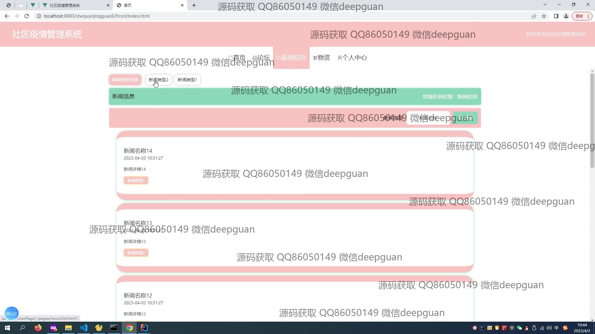
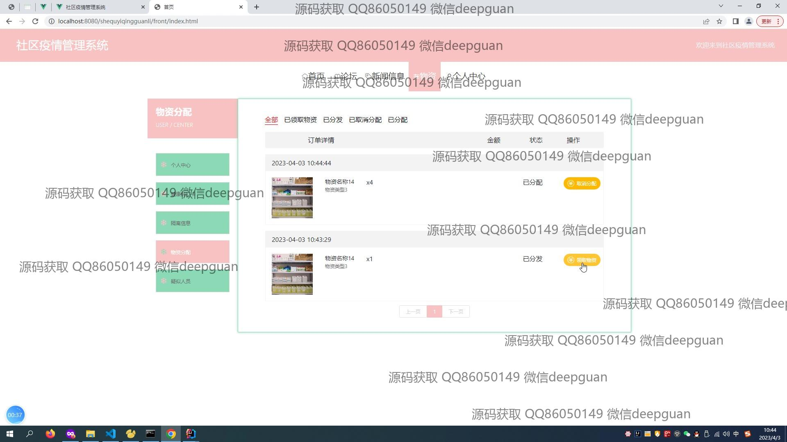
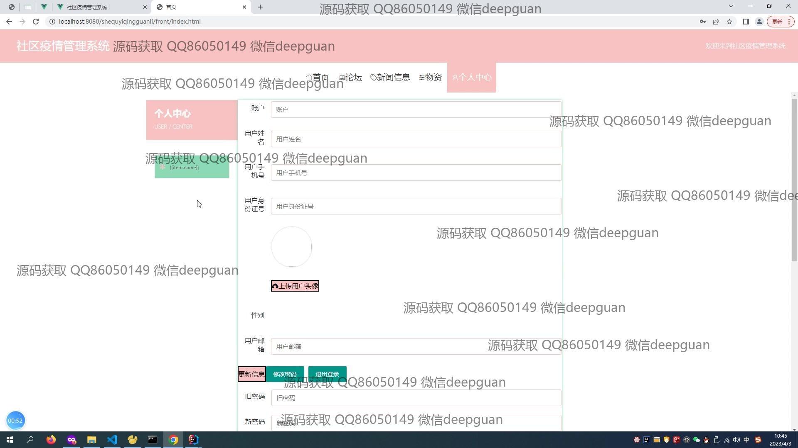
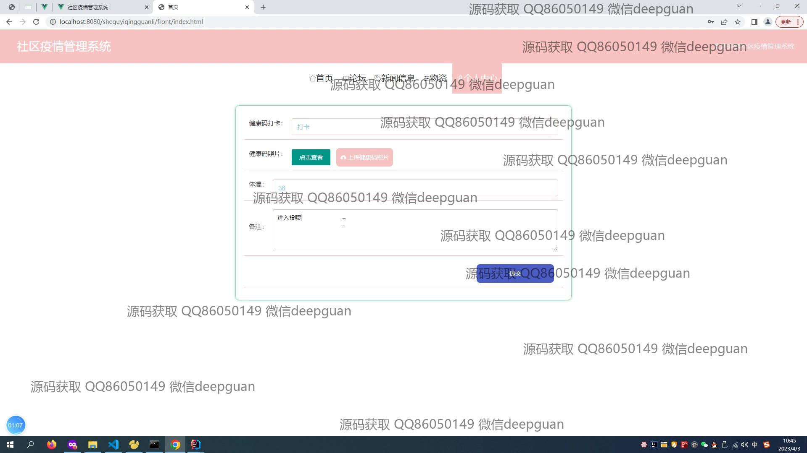
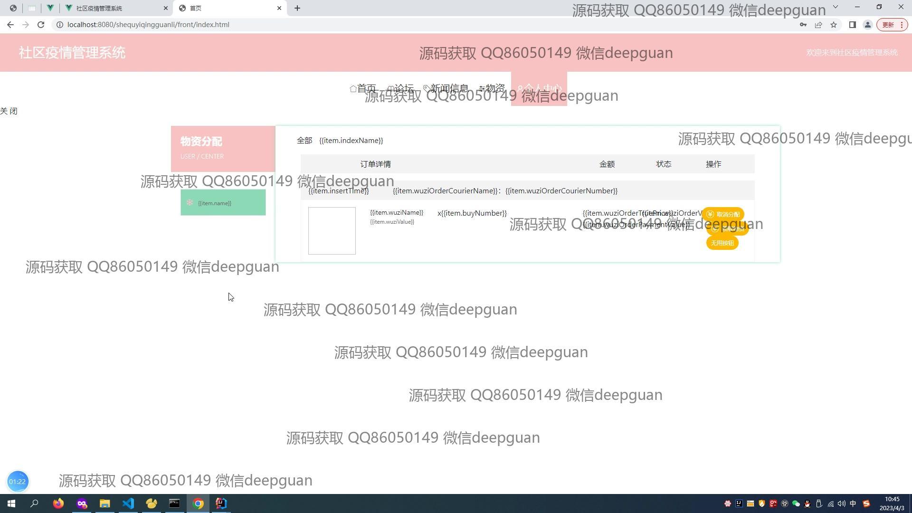
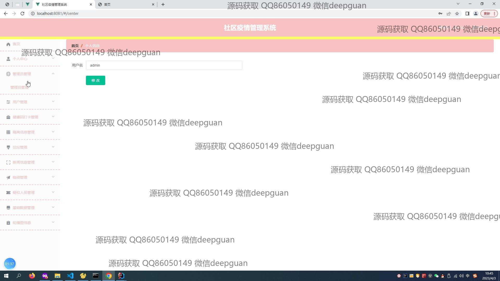
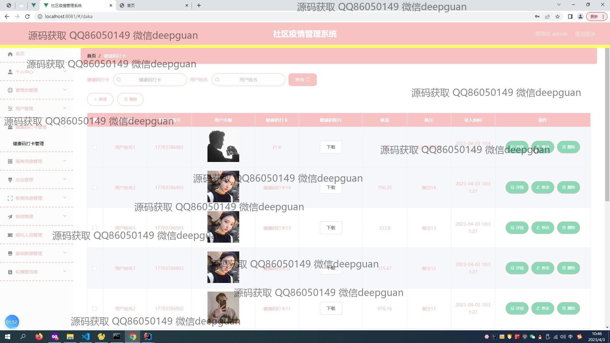
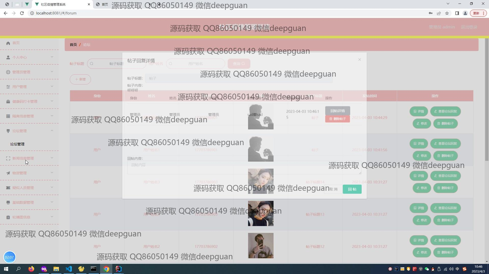
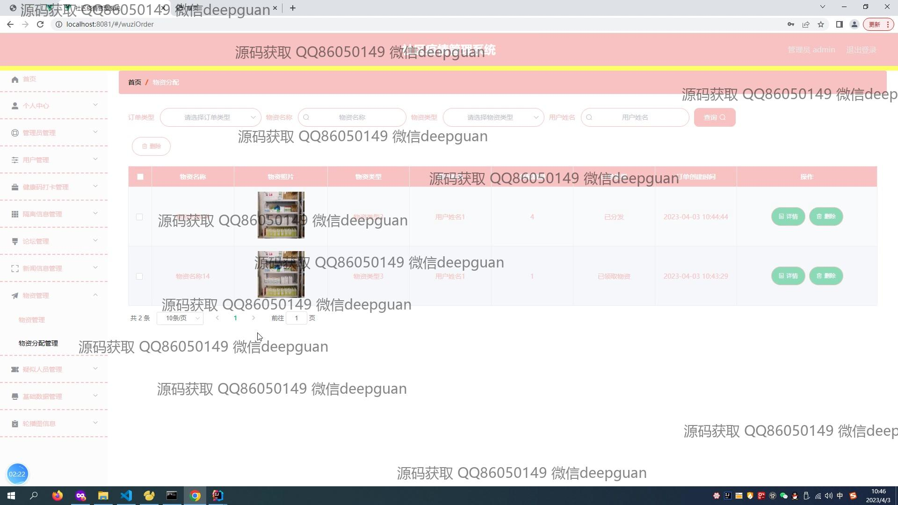
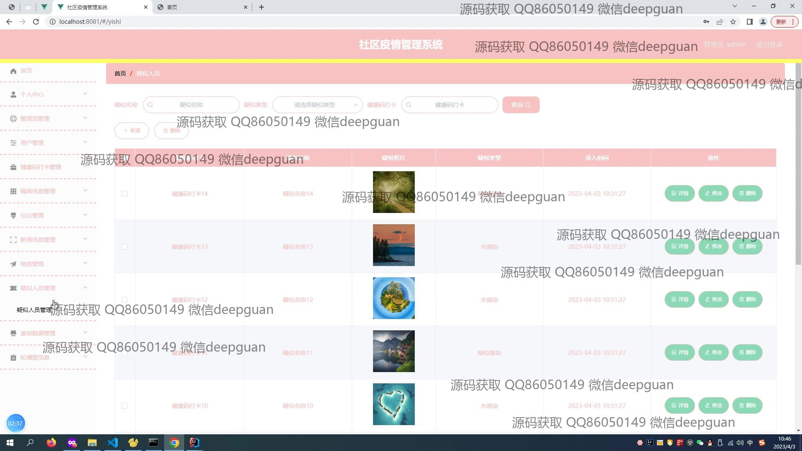
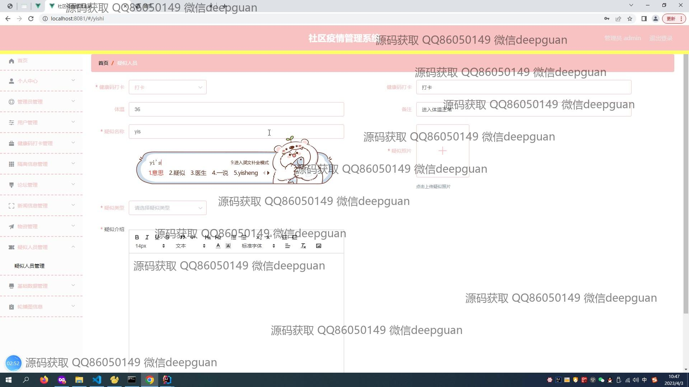
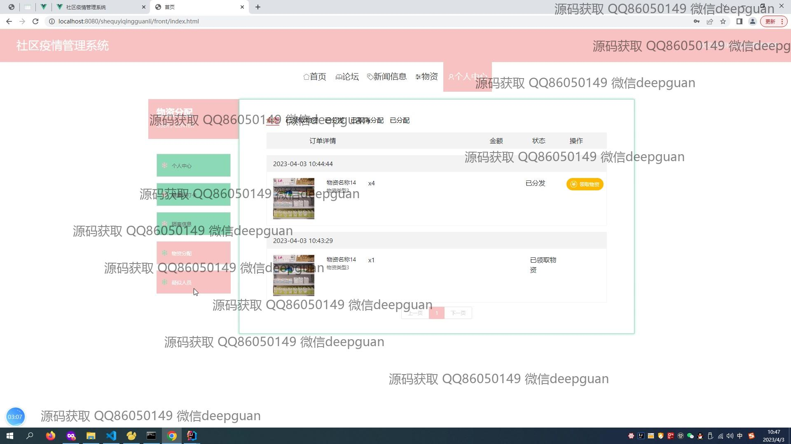
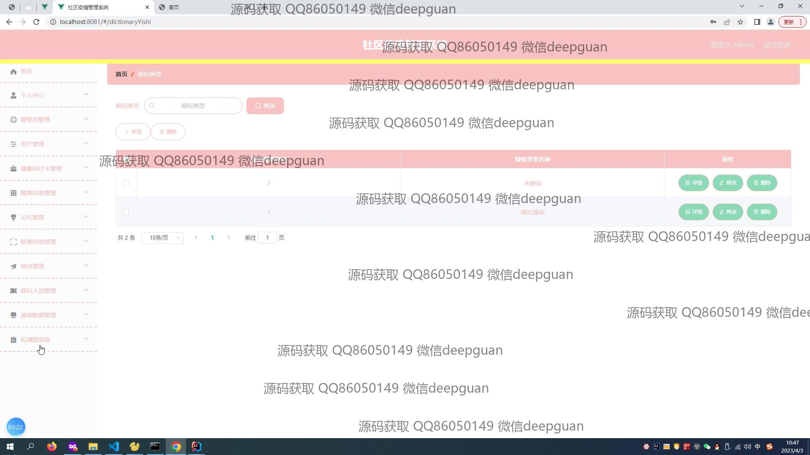

本代码来源于网络,仅供学习参考使用!

